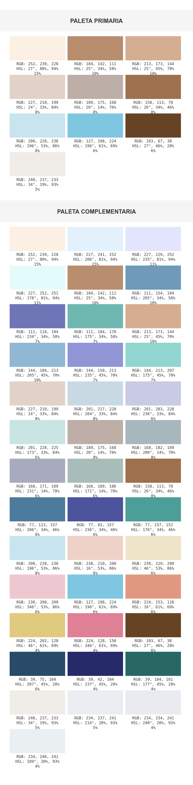

# Generador de Paletas de Colores

Una aplicación web que genera paletas de colores a partir de imágenes, con capacidad para exportar en múltiples formatos y generar esquemas de color complementarios.

## 🎨 Características

- **Extracción de Colores**: Analiza imágenes para extraer hasta 10 colores dominantes
- **Paletas Complementarias**: Genera automáticamente colores complementarios
- **Múltiples Formatos de Exportación**:
  - PNG con información detallada
  - Variables CSS
  - Variables SCSS
- **Información Detallada de Colores**:
  - Valores RGB
  - Valores HSL
  - Porcentaje de presencia en la imagen

## 🚀 Instalación

1. Clona el repositorio:
```bash
git clone https://github.com/686f6c61/generador-colores-rgb-hsl-exportador-png/.git
```
2. Instala las dependencias:
```bash
pip install -r requirements.txt
```
3. Ejecuta la aplicación:
```bash
python app.py
```

## 💻 Uso

### Carga de Imágenes
- Arrastra y suelta una imagen en la zona designada
- O usa el botón de selección de archivo

### Visualización de Colores
Cada color muestra:
- Código RGB
- Código HSL (clic para alternar)
- Porcentaje de presencia en la imagen

### Exportación

#### Como PNG

Genera una imagen con:
- Paleta principal
- Paleta complementaria (si se generó)
- Información detallada de cada color

#### Como Variables CSS

```css
/* Ejemplo de salida */
:root {
--color-1: rgb(45, 52, 54);
--color-1-rgb: 45, 52, 54;
--color-1-hsl: 194, 7%, 20%;
--color-1-percentage: 35%;
}
```

#### Como Variables SCSS

```scss
/* Ejemplo de salida */
$color-1: rgb(45, 52, 54);
$color-1-rgb: 45, 52, 54;
$color-1-hsl: 194, 7%, 20%;
$color-1-percentage: 35%;
```

### Paletas Complementarias
- Genera automáticamente colores complementarios
- Incluye variaciones análogas
- Mantiene la información de porcentaje de presencia

### 📸 Ejemplo Visual


*Ejemplo de paleta extraída de una imagen y sus colores complementarios*

La imagen de ejemplo muestra:
- Panel superior: Paleta principal extraída de la imagen
- Panel inferior: Paleta complementaria generada automáticamente
- Para cada color: valores RGB, HSL y porcentaje de presencia

## 🛠 Características Técnicas

- Algoritmo de clustering K-means para extracción de colores
- Conversión entre espacios de color RGB y HSL
- Cálculo de distancias de color para asegurar diversidad
- Muestreo adaptativo basado en el tamaño de la imagen
- Interfaz responsive con Bulma CSS

